# SirCustomAssetGraph

# Оглавление
1. [Основные функции для работы с графом.](https://github.com/sirotkin76/SirCppCustomGraphAssetEditor/blob/main/README.md#%D0%BE%D1%81%D0%BD%D0%BE%D0%B2%D0%BD%D1%8B%D0%B5-%D1%84%D1%83%D0%BD%D0%BA%D1%86%D0%B8%D0%B8-%D0%B4%D0%BB%D1%8F-%D1%80%D0%B0%D0%B1%D0%BE%D1%82%D1%8B-%D1%81-%D0%B3%D1%80%D0%B0%D1%84%D0%BE%D0%BC)
2. [Basic functions for working with a graph.](https://github.com/sirotkin76/SirCppCustomGraphAssetEditor/blob/main/README.md#basic-functions-for-working-with-a-graph)
3. [Настройка для "Asset Мanager".](https://github.com/sirotkin76/SirCppCustomGraphAssetEditor/blob/main/README.md#ru---%D0%B2%D0%B5%D1%80%D1%81%D0%B8%D1%8F-%D0%BD%D0%B0%D1%81%D1%82%D1%80%D0%BE%D0%B5%D0%BA)
4. [Setting up for "Asset Manager".](https://github.com/sirotkin76/SirCppCustomGraphAssetEditor/blob/main/README.md#en---settings-version) 

## Basic settings of the "SirCustomAssetGraph" plugin.
1. Add a plugin to Unreal Engine ["SirCustomAssetGraph"]([https://docs.gitlab.com/user/project/repository/web_editor/#create-a-file](https://www.fab.com/ru/listings/fba37d0c-9894-4111-b85c-60c0b133e9d2)).
2. Connect the plugin to your project in the plugins tab.
3. **!IMPORTANT!** In **"Asset Manager"** of your project, specify the path where the data assets will be located and set the type of data asset used to **"SirCppDataAssetAttrV3"**.
4. In your project's **"Asset Manager"**, set the **"Cook Rule"** to **"Always Cook"**.

## Settings Asset Manager

1. Add new Primary Asset Type = **SirCppDataAssetAttrV3**
2. Change Asset Base Class = **SirCppDataAssetAttrV3**
3. **Add the path to the folder with your data asset data.**
4. **Cook Rule = Always Cook**

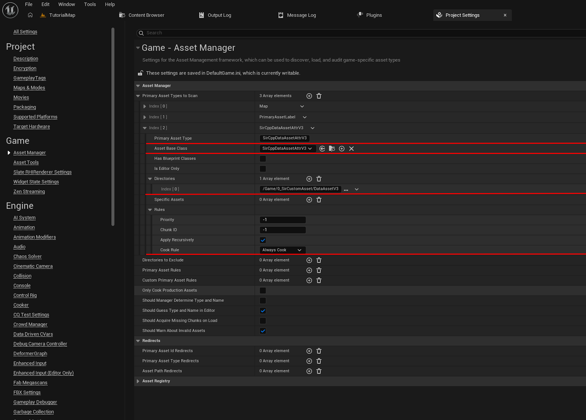

# Basic functions for working with a graph.

1. Create an empty actor. Add the actor to the game world. Create a variable of the "SirCppCustomGraphAsset" type in the actor.
2. We specify the graph in the created variable.
3. Now you can get all the necessary functions from this variable, pull out the node and write **sircpp**

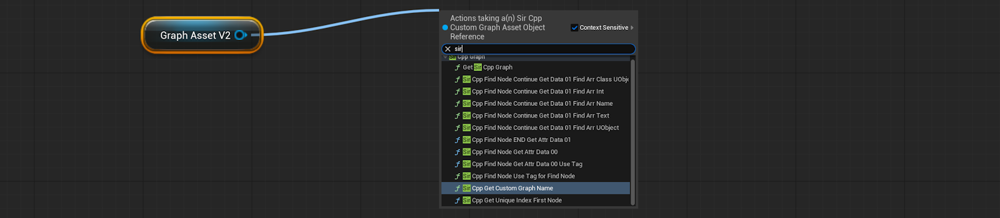

4. Function **SirCppGetUniqueIndexFirstNode**.  
From the variable with the gaf, we obtain the function “**SirCppGetUniqueIndexFirstNode**”. At the output of this function, we obtain the index of the first node that is connected to the Start node.

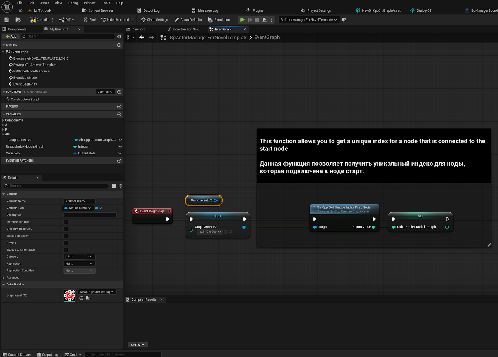

5. Function **SirCppFindNodeGetAttrData00**
Knowing a node's unique index, a developer can easily access the node and retrieve the information contained therein. For example, the basic attributes of a node are "**00 Attr**"

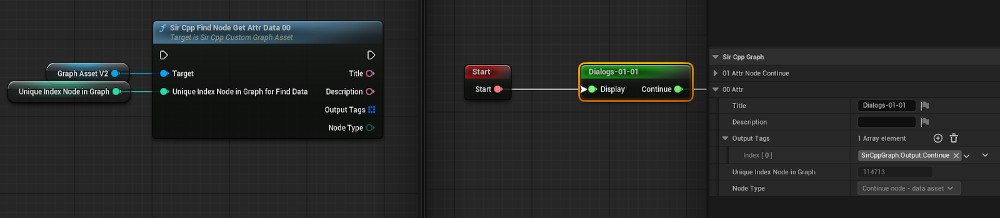

6. **OutputTags** attribute - An array of tags that the developer set at the node output.
If a node has multiple output parameters, we create a separate widget where we specify the response tag. Using this data, we can find the node connected to a given response and obtain all the necessary information.

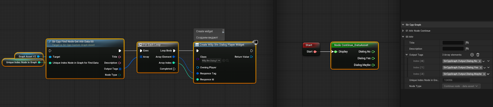

7. Function **SirCppFindNodeGetAttrData00_UseTag**
The player clicks on the widget with the answer, the widget returns this answer to the actor, where the developer can use the “**SirCppFindNodeGetAttrData00_UseTag**” function to obtain the unique index of the node that is connected to this answer.

**IMPORTANT**: The response tag must be unique. This is because the function's logic finds the first similar tag and allows the data to be retrieved from the first one found.

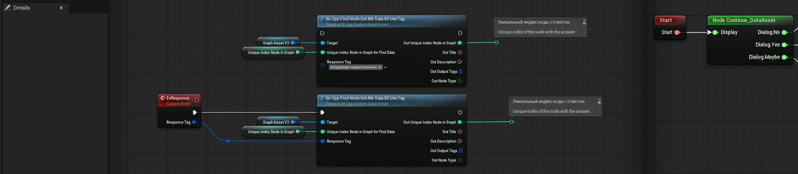

8. The **End** node in the graph has its own attributes that the developer can set.

   *TagForFindNode*   - Tag. Example for searching a graph for nodes with the same unique tag.
   
   *CustomAction*     - A string. The developer specifies, via a condition, which action will be performed. (If CustomAction == Quest, then complete the quest.)
   
   *PrimaryDataAsset* - data asset.
   
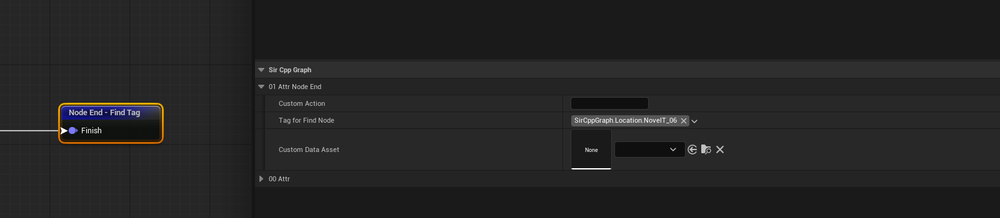

9. Function **SirCppFindNode_END_GetAttrData_01**

   We obtain the node's unique value from the base function and check the node type to see if it's an **End node**. If so, we find the **SirCppFindNode_END_GetAttrData_01** function in the graph variable and pass the node's unique value there, either directly or through a variable. Afterwards, we can work with the values ​​from this node at the output.

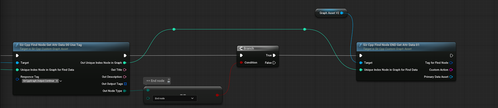

10. To construct the graph body there are 2 nodes:

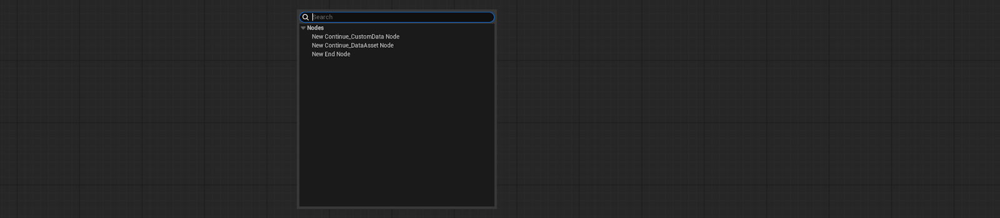

**Continue node - Custom data** (All parameters are specified within this node)
    
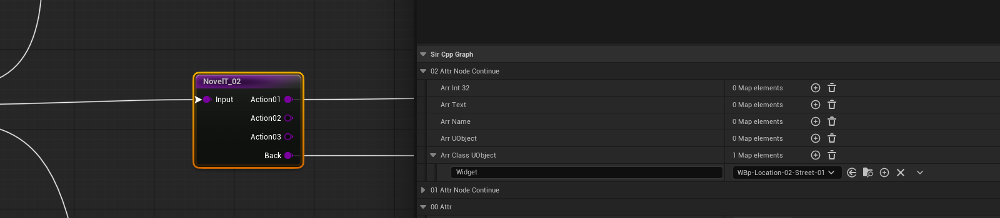

**Continue node - Data asset** (The node contains a data asset)
    
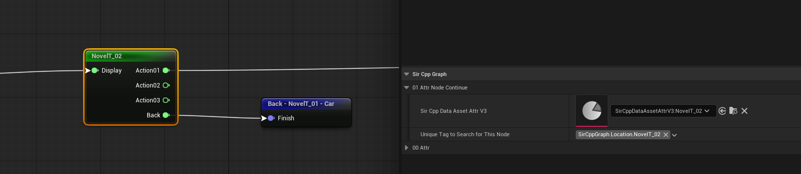

11. Both nodes have the **UniqueTagToSearchForThisNode** attribute of type tag.

    The basic idea is to set a unique tag for a given node and use the **SirCppFindNodeUse_TagForFindNode** function to find the unique index of the node with the current unique tag. 
    
    For example, you're making a novel and you need to return to the previous node using the back button, or search the graph for some unique node that might not be connected at all, but contains the necessary information.

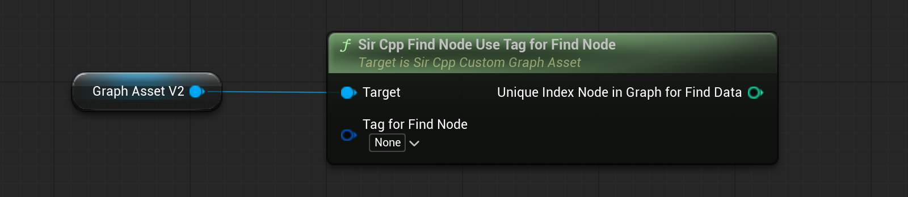

12. All functions for the **Continue Custom Data** and **Continue Data Asset** nodes

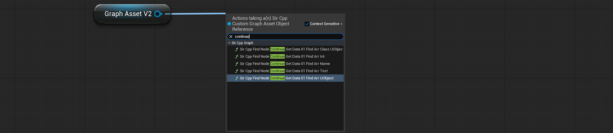

13. We access the data in the Continue node (**Continue Custom Data** or **Continue Data Asset**)

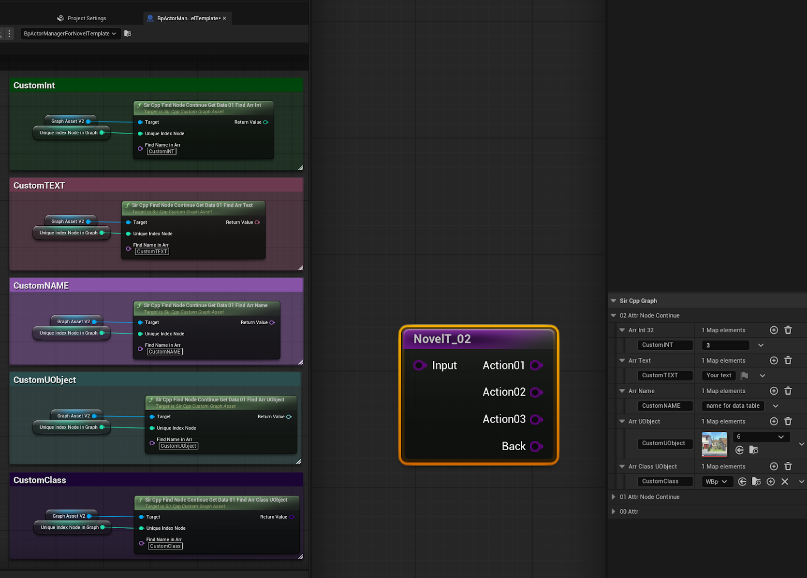

**IMPORTANT**: The name for each field must be unique! Using **None** will result in an error when attempting to create a new value.

**SirCppFindNodeContinueGetData_01_FindArrInt**
- Returns an integer.

**SirCppFindNodeContinueGetData_01_FindArrText**
- Returns text.

**SirCppFindNodeContinueGetData_01_FindArrName**
- Returns a variable of type Name (Used for data tables)

**SirCppFindNodeContinueGetData_01_FindArrUObject**
- Returns an object (such as a texture, material, or static mesh)

**SirCppFindNodeContinueGetData_01_FindArrClassUObject**
- Returns the class of the object (Widgets or spawn class)

## Базовые настройки плагина
*Основные настройки для плагина "SirCustomAssetGraph".*
1. Добавить в Unreal Engine плагин ["SirCustomAssetGraph"]([https://docs.gitlab.com/user/project/repository/web_editor/#create-a-file](https://www.fab.com/ru/listings/fba37d0c-9894-4111-b85c-60c0b133e9d2)).
2. Подключите плагин в своём проекте во вкладке plugins.
3. **!ВАЖНО!** Укажите в **"Asset Мanager"** своего проекта путь, где будут располагаться дата ассеты и установите тип используемого дата ассета **"SirCppDataAssetAttrV3"**.
4. Установите в **"Asset Manager"** своего проекта правило для **"Cook Rule"** которое будет равно **"Always Cook"**.

## Настройки Asset Manager
1. Добавьте Primary Asset Type = **SirCppDataAssetAttrV3**
2. Измените Asset Base Class на **SirCppDataAssetAttrV3**
3. **Добавьте путь к папке с Data Assets данными.**
4. Правило **Cook Rule = Always Cook**

----------------------------------------------------------------------------------------

# Основные функции для работы с графом.

1. Создаем пустой актор. Добавляем актор в мир с игрой. В акторе создаем переменную типа “SirCppCustomGraphAsset”.  
2. Указываем в созданной переменной граф.
3. Теперь вы можете получить из данной переменной все нужные функции, вытянете ноду и напишите **sircpp**

4. Функция **SirCppGetUniqueIndexFirstNode**.  
Из переменой с гафом получаем функцию “**SirCppGetUniqueIndexFirstNode**". На выходе данной функции получаем индекс первой ноды, которая подключена к ноде Start.

5. Функция **SirCppFindNodeGetAttrData00**
Зная уникальный индекс ноды, разработчик может свободно обращаться к ноде и получать указанную там информацию. Например, базовые атрибуты ноды “**00 Attr**” 

6. Атрибут **OutputTags** - Массив тегов, которые разработчик задал на выходе ноды.
Если нода имеет несколько выходных параметров, создаем отдельный виджет, куда указываем тэг ответа. По этим данным мы можем найти ноду, которая подключена к данному ответу. И получить всю нужную информацию.

7. Функция **SirCppFindNodeGetAttrData00_UseTag**
Игрок нажимает на виджет с ответом, виджет данный ответ возвращает в актор, где разработчик через функцию “**SirCppFindNodeGetAttrData00_UseTag**” может получить уникальный индекс ноды, которая подключена к данному ответу. 

**ВАЖНО**: Тег ответа должен быть уникальным. Так как логика функции находит первый похожий тег и даёт возможность получить данные именно первого найденного.

8. Нода **End** в графе имеет свои собственные атрибуты, которые разработчик может задать.

   *TagForFindNode*   - тег. Пример, для поиска в графе ноды с таким же уникальным тегом.
   
   *CustomAction*     - строка. Разработчик сам указывает, через условие, какое действие будет выполнятся. (Если CustomAction == Quest, то выполнять квест.)
   
   *PrimaryDataAsset* - дата ассет.
   

9. Функция **SirCppFindNode_END_GetAttrData_01**

   Получаем из базовой функции уникальное значение ноды и проверяем тип ноды, относится ли она к **End node**. Если да, то в переменной графа находим функцию **SirCppFindNode_END_GetAttrData_01** и передаем туда уникальное значение ноды. На прямую или через переменную. После чего на выходе можем работать уже со значениями из данной ноды.

10. Для построения тела графа имеются 2 ноды:

**Continue node - Custom data** (Все параметры указываются внутри данной ноды)
    

**Continue node - Data asset** (Нода содержит в себе дата ассет)
    

11. Обе ноды имеют атрибут **UniqueTagToSearchForThisNode** типа тег.

    Базовое значение в том, чтобы задавать уникальный тег для данной ноды и используя функцию **SirCppFindNodeUse_TagForFindNode** находить уникальный индекс ноды с текущим уникальным тегом. 
    
    Например, вы делаете новелу и вам нужно возвращаться на кнопку back назад, на предыдущую ноду или искать в графе какую-то уникальную ноду, которая может быть вообще не подключена, но содержать нужную информацию.

12. Все функции для ноды **Continue Custom Data** и **Continue Data Asset**

13. Обращаемся к данным в ноде Continue (**Continue Custom Data** или **Continue Data Asset**)

**ВАЖНО**: Наименование для каждого поля должны быть уникальными! Использовать имя **None** приведёт к ошибке, при попытке создать новое значение.

**SirCppFindNodeContinueGetData_01_FindArrInt**
- Возвращает целое число.

**SirCppFindNodeContinueGetData_01_FindArrText**
- Возвращает текст.

**SirCppFindNodeContinueGetData_01_FindArrName**
- Возвращает переменную типа Name (Используется для дата тейблов)

**SirCppFindNodeContinueGetData_01_FindArrUObject**
- Возвращает объект (Например текстуры, материал или статик меш)

**SirCppFindNodeContinueGetData_01_FindArrClassUObject**
- Возвращает класс объекта (Виджеты или класс для спавна)

